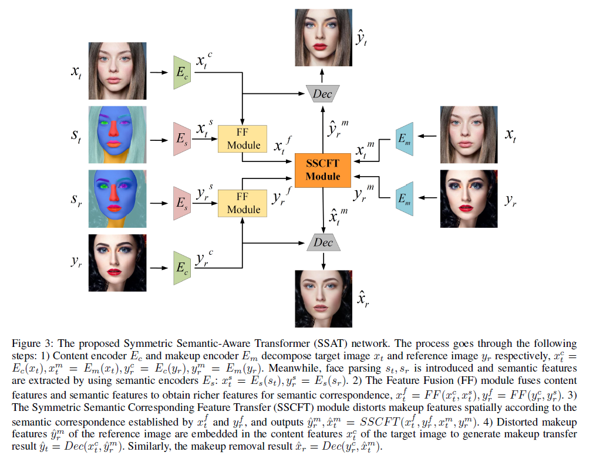
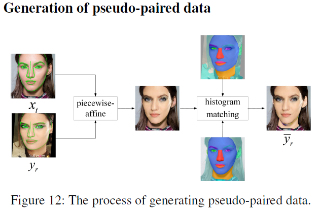

# SSAT: A Symmetric Semantic-Aware Transformer Network for Makeup Transfer and Removal

This is the official  MSP code for [SSAT: A Symmetric Semantic-Aware Transformer Network for Makeup Transfer and Removal](https://arxiv.org/abs/2112.03631), which has been accepted by AAAI-2022. This MSP project contains complete training code and test code. In addition, we have provided the [Pytorch code](https://github.com/Snowfallingplum/SSAT), so that you can quickly realize makeup transfer. 

## Our model



## How to train SSAT model

### (1) Pseudo-paired data



At the end of the paper, the additional material section introduces the synthesis process of pseudo-paired data in detail.

### (2) Preparing the data set 

```
├─── dataset # dataset
 ├── images
  ├─ non-makeup
  ├─ makeup
  └─ warp # This is where the generated pseudo-paired data is stored
 └── seg1
  ├─ non-makeup
  └─ makeup
```


### (3)  Train code

Modify the 'dataroot' parameter in 'option.py' based on the path location of your own data set.

```
python train.py
```

## Test

### (1) Data preparation

```
├─── test # test dataset
 ├── images
  ├─ non-makeup
  └─ makeup
 └── seg1
  ├─ non-makeup
  └─ makeup
```

### (2) Test

Modify the 'dataroot' parameter in 'option.py' based on the path location of your own test data set.

```
python test.py
```


## Our results 


## Citation

Please consider citing this project in your publications if it helps your research. The following is a BibTeX reference. The BibTeX entry requires the url LaTeX package.

```
@InProceedings{Sun_2022_AAAI,
  author = {Zhaoyang Sun and  Yaxiong Chen and Shengwu Xiong},
  title = {SSAT: A Symmetric Semantic-Aware Transformer Network for Makeup Transfer and Removal},
  booktitle = {AAAI},
  year = {2022}
}
```

